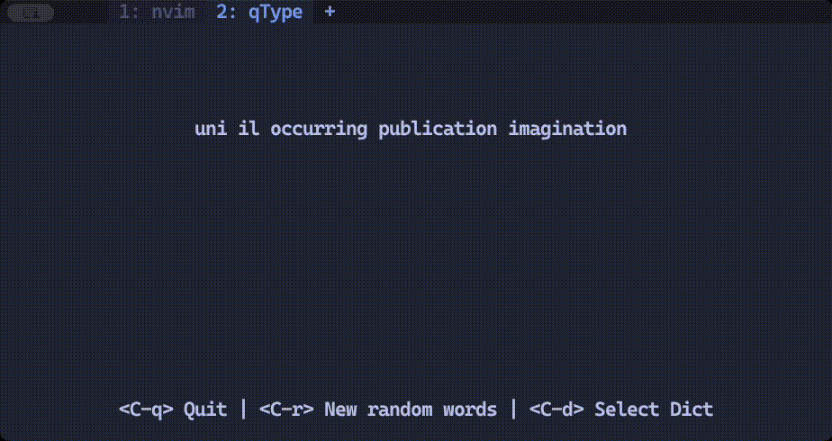

# **qType**

qType (from _Quick Type_) is a 🚀 _blazingly fast_ 🚀\* terminal-based typing practice tool,
inspired by [keybr] and [monkeytype]. Typing inside the terminal eliminates the
overhead of browsers, providing a smoother, more focused experience without the
disruptions of Web-UI freezes.

Currently, qType is my **Rust-learning project**, but who knows—maybe one day
it will evolve into something much more.

[keybr]: https://www.keybr.com/
[monkeytype]: https://monkeytype.com/

_\* It's not really "blazingly fast", but since it's a Rust project, this
phrase is a must-include as a meme._

## Installation

WIP

## **Why qType?**

- **Minimalist Interface**: A distraction-free environment tailored for
  terminal enthusiasts.
- **Performance**: Leveraging Rust's speed, qType delivers a seamless
  experience with low resource usage.
- **Focus on Typing**: No browser, no fluff — just pure typing practice.

## **Demo**

## **Planned Features**

- **Smarter Word Randomizer**: Words selected based on usage frequency and
  typing patterns.
- **Custom Dictionaries**: Support for user-defined dictionaries and additional
  languages.
- **Accurate WPM/CPM Calculation**: Improved metrics for better accuracy and
  insights.
- **Comprehensive Stats**: A dedicated stats screen with SQLite integration for
  tracking progress over time.
- **Prettier UI**: A more intuitive terminal interface.
